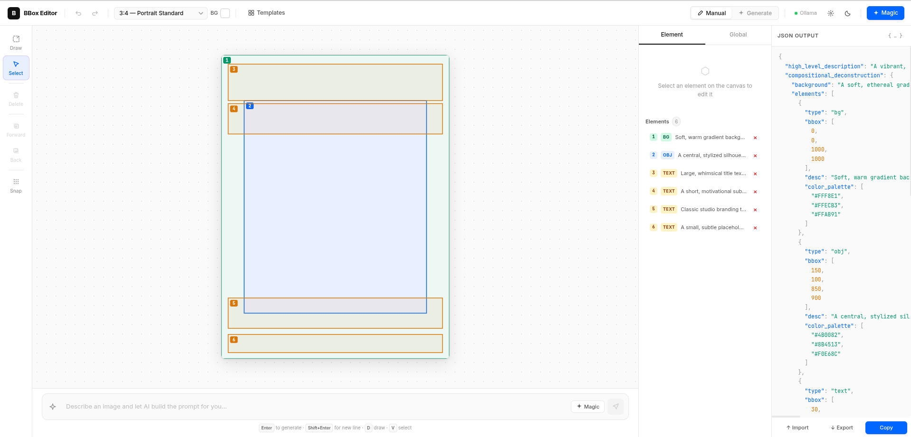

# Ideogram BBox Editor

> A visual canvas editor that builds structured JSON prompts for **Ideogram 4** — the open-weight image generation model that accepts bounding box coordinates for precise spatial control.

Instead of writing JSON by hand, you draw rectangles on a canvas, fill in descriptions, and the prompt is assembled in real time.



---

## What it does

Ideogram 4 accepts prompts as structured JSON with bounding boxes — each element of the image (objects, text, backgrounds) gets its own region and description. Writing these by hand is tedious and error-prone.

This editor gives you a visual interface to:

- **Draw bounding boxes** on a canvas with the correct aspect ratio
- **Describe each element** (type, description, inline text, color palette)
- **Set the global style** (aesthetics, lighting, medium, color palette)
- **Copy the JSON** ready to paste into Ideogram

The AI features (**Magic Prompt** and **Generate from text**) are optional accelerators — the editor works fully without them.

---

## What's new in this fork

- Generate now retries twice after a failed request or invalid JSON response.
- Canvas navigation supports panning by holding the middle mouse button.
- Elements can be copied and pasted from the toolbox or with `Ctrl+C` / `Ctrl+V`.
- New element type: `character`, for people, superheroes, mascots, and named fictional subjects.
- Optional advanced element types: `animal` and `crowd`, enabled from Settings.
- Element colors are easier to distinguish on the canvas and in the element list.
- Project history and quick save/load controls are available from the toolbar.
- Cloud AI providers now include OpenAI, Anthropic, OpenRouter, Mistral, Google AI Studio, and LM Studio.

---

## Installation

### Requirements

- [Node.js 18+](https://nodejs.org) — required to run the app
- [Ollama](https://ollama.com) — optional, enables local AI with no API key

---

### Automatic — double-click to start

Download or clone the repo, then double-click the file for your OS.  
On first run the script installs dependencies automatically and opens the browser.

| OS | File | Note |
|---|---|---|
| **macOS** | `start.command` | First launch: right-click → **Open** → **Open** (Gatekeeper bypass) |
| **Windows** | `start.bat` | If SmartScreen appears: **More info → Run anyway** |
| **Linux** | `start.sh` | Run `chmod +x start.sh` once to make it executable |

The app opens at `http://localhost:5173`. Close the terminal window to stop it.

<!-- IMG: screenshot of Finder (macOS) or Explorer (Windows) with the start file highlighted. -->

---

### Manual

```bash
git clone https://github.com/YOUR_USERNAME/ideogram-bbox-editor.git
cd ideogram-bbox-editor
npm install
npm run dev
```

Open `http://localhost:5173`.

---

### First-time setup with Ollama (optional)

Run the installer once to set up Ollama and pull the AI model interactively:

```bash
# macOS / Linux
./install.sh

# Windows
install.bat
```

The installer asks whether to install Ollama and download `gemma4:e2b` (~3 GB). Both steps are optional — skip them if you prefer to use a cloud provider instead.

---

## Configuration

### AI backend

Click **⚙** in the toolbar to open Settings. Three modes are available:

| Mode | Behaviour |
|---|---|
| **Ollama only** | Always uses local Ollama — shows an error if it is offline |
| **Auto** *(default)* | Uses Ollama if running, falls back to the cloud provider otherwise |
| **Cloud only** | Always uses the configured cloud provider |

<!-- IMG: screenshot of the Settings modal with the backend selector visible. -->

### Cloud provider

When using a cloud provider, select one and paste your API key in Settings:

| Provider | Default model | Where to get a key |
|---|---|---|
| OpenAI | `gpt-4o-mini` | [platform.openai.com](https://platform.openai.com) |
| Anthropic | `claude-haiku-4-5` | [console.anthropic.com](https://console.anthropic.com) |
| OpenRouter | `openai/gpt-4.1-mini` | [openrouter.ai](https://openrouter.ai) — free tier available |
| Mistral | `mistral-large-latest` | [console.mistral.ai](https://console.mistral.ai) |
| Google AI Studio | `gemini-2.5-flash` | [aistudio.google.com](https://aistudio.google.com) |
| LM Studio | `local-model` | Local OpenAI-compatible server, no cloud key required |

You can override the model ID in the **Model** field (leave blank to use the default).  
API keys are stored in browser `localStorage` only — never sent anywhere except the selected provider.

### Ollama model

To use a different local model, change `MODEL` at the top of `src/ai.js`:

```js
const MODEL = 'llama3.2';  // any model you have pulled with `ollama pull`
```

---

## How to use

There are two ways to build a prompt: **manually** (full control over every element) or **automatically** (AI generates everything from a text description).

---

### Manual mode

Draw bounding boxes yourself, describe each element, and copy the JSON.


#### 1 — Set the canvas

Choose the **aspect ratio** from the dropdown in the toolbar (1:1, 16:9, 9:16, etc.).  
This sets the proportions of the output image.

#### 2 — Draw bounding boxes

Press **D** (or click **Draw** in the toolbox) and drag on the canvas to create a region.  
Each box becomes one element in the JSON.

#### 3 — Describe each element

After drawing, the editor switches to **Select** mode automatically.  
Click an element to open its properties:

- **Type** — `obj` (object), `character` (person / mascot / named fictional subject), `text` (text overlay), or `bg` (background layer). Enable **Extra element types** in Settings to add `animal` and `crowd`.
- **Description** — what this region contains, in as much detail as you want
- **Text content** — the literal string to render (only for type `text`)
- **Color palette** — up to 5 hex colors for this element

#### 4 — Fill global fields

In the right panel, fill in:

- **High-level description** — one sentence summarising the whole image
- **Style** — aesthetics, lighting, medium (photo / illustration / graphic design…)
- **Background** — description of the scene environment
- **Global color palette** — up to 16 colors for the overall image

#### 5 — Copy and use the JSON

The **JSON sidebar** on the right always shows the correctly serialized prompt.  
Click **Copy** to copy it to the clipboard, then paste it directly into Ideogram.

Use **Export** to save a `.json` file and **Import** to reload it later.

---

### Automatic mode — Generate from text

Switch to **Generate** in the toolbar, describe the image in plain language, and the AI builds the full JSON from scratch — bounding boxes, style, colors, and text copy — loading it directly onto the canvas. You can then edit any element manually before copying.


---

### ✦ Magic Prompt

Works in both modes. After placing your elements, click **Magic** to let the AI enrich all descriptions and fill any empty global fields — **without touching bounding boxes, color palettes, or text content**.

---

## Template gallery

Click **Templates** in the toolbar to start from a pre-built layout.  
All elements are fully editable after loading.

<!-- IMG: screenshot of the Template Gallery modal with all 7 cards visible. -->

| Template | Ratio | Description |
|---|---|---|
| Character Portrait | 9:16 | Full-body character on a dark fantasy background |
| Product Shot | 1:1 | Minimalist product photography with text labels |
| Epic Landscape | 16:9 | Cinematic aerial scene at dusk |
| Typography Poster | 4:3 | Modernist Swiss-style typographic composition |
| Event Poster | 9:16 | Concert / festival poster with lineup and artwork |
| Infographic | 4:3 | Three-column data layout with icons and statistics |
| Interior Scene | 16:9 | Scandinavian living room with natural light |

---

## Keyboard shortcuts

| Action | Shortcut |
|---|---|
| Draw mode | `D` |
| Select mode | `V` |
| Delete selected element | `Delete` / `Backspace` |
| Copy selected element | `Ctrl+C` |
| Paste copied element | `Ctrl+V` |
| Undo | `Ctrl+Z` |
| Redo | `Ctrl+Y` |

---

## JSON schema reference

The output follows the [Ideogram 4 caption schema](https://github.com/ideogram-oss/ideogram4/blob/main/docs/prompting.md) with strict key ordering:

```json
{
  "high_level_description": "...",
  "style_description": {
    "aesthetics": "...",
    "lighting": "...",
    "photo": "...",
    "medium": "photograph",
    "color_palette": ["#RRGGBB"]
  },
  "compositional_deconstruction": {
    "background": "...",
    "elements": [
      { "type": "obj",  "bbox": [200, 150, 800, 600], "desc": "..." },
      { "type": "text", "bbox": [50,  50,  120, 300], "text": "HELLO", "desc": "..." }
    ]
  }
}
```

Bounding boxes: `[y_min, x_min, y_max, x_max]`, normalized 0–1000.

---

## Stack

- [React 19](https://react.dev) + [Vite 8](https://vitejs.dev) — no UI framework, no external state library
- SVG canvas with native DOM events (mouse + touch)
- `useReducer` + `useRef`-based undo/redo stack (100 steps)
- [Ollama](https://ollama.com) for local AI inference (optional)
- OpenAI / Anthropic / OpenRouter / Mistral / Google AI Studio / LM Studio as AI backends (optional)

## License

MIT
